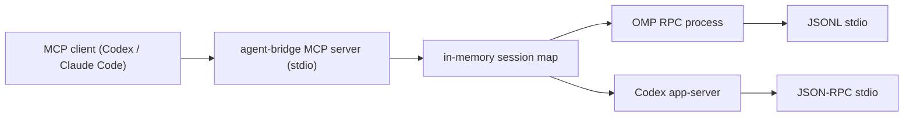

# Agent Bridge Development

This document explains how Agent Bridge is structured, how to test it, and how to release a local plugin build.

## Project Layout

```text
agent-bridge/
  .codex-plugin/plugin.json      Codex plugin manifest
  .mcp.json                      MCP server declaration used by the plugin
  scripts/agent-bridge.mjs       MCP server and backend adapter implementation
  skills/agent-bridge/SKILL.md   Instructions Codex should follow when using the bridge
  docs/REQUIREMENTS.md           Product requirements and TODOs
  docs/INSTALLATION.md           Installation and usage guide
  docs/DEVELOPMENT.md            Development notes
  README.md                      User-facing documentation
```

There are no npm dependencies. The runtime uses Node built-ins plus external CLIs:

- `omp`
- `codex`

## Architecture



Agent Bridge exposes a small MCP tool surface:

- `agent_bridge_open_session`
- `agent_bridge_send_message`
- `agent_bridge_status`
- `agent_bridge_result`
- `agent_bridge_abort`
- `agent_bridge_close_session`
- `agent_bridge_doctor`

Each `agent-bridge mcp` process keeps its own in-memory session map for its own lifetime; one MCP client equals one MCP process equals one session map. A session is not persisted by Agent Bridge itself, and sessions are never shared across clients.

The MCP server owns its sessions directly: `callTool` invokes `openSession`/`sendMessage`/… in-process and spawns the OMP/Codex backends as children of the MCP process. There is no background daemon, no Unix socket, and no `requestDaemon` proxy. The bridge speaks MCP over stdio only and opens no network listener of any kind. As of v0.7.0 the entire HTTP/SSE Web UI stack was removed (see [ARCHITECTURE.md](ARCHITECTURE.md)); `session.events` is still buffered to back `recentEvents` in `status`/`result`, but it is no longer broadcast anywhere.

Sessions are managed exclusively through the MCP tools. The CLI exposes only `mcp` (the server entrypoint) plus `doctor` and `cleanup` helpers.

## Process Lifecycle

Agent Bridge owns every child process it starts and records those process ids in:

```text
~/.agent-bridge/pids/
```

The MCP server owns its sessions directly and cleans up every active session when it receives `SIGTERM`, `SIGINT`, or `SIGHUP`, when stdin closes (the client exited), when stdout closes with `EPIPE`, or when an uncaught exception/unhandled rejection reaches the process boundary. On stdin close it waits for pending async MCP responses before exiting. A clean exit (code 0) also removes that run's log directory `~/.agent-bridge/logs/<runId>/`; a crash (code !== 0) keeps it for debugging. Each run dir carries an `owner` file holding the server's pid, so the next server's startup sweep (and `cleanup`) can reclaim `logs/<runId>/` dirs whose owning server is gone — abandoned crash dirs do not accumulate.

Normal `agent_bridge_close_session` calls remove the pid record immediately. Process-level shutdown leaves pid records in place after sending `SIGTERM`; this is intentional. If a child ignores termination or Agent Bridge is killed abruptly, the next MCP startup reads those records, verifies that the process command still matches an Agent Bridge backend such as `omp --mode rpc` or `codex app-server`, and terminates the recorded process tree. Stale records for already-exited processes are removed.

Pid-record cleanup treats only `agent-bridge mcp` as a live owner (the owner-alive check matches `\bmcp\b` in the owning process command). A record whose owning MCP process is still running is skipped so its active OMP/Codex children are never terminated; `cleanup` only reaps orphans whose owning MCP server is gone (SIGTERM followed by a SIGKILL backstop), and also deletes abandoned `logs/<runId>/` dirs from those dead servers.

This cleanup cannot run after `SIGKILL` (`kill -9`) because no Node.js code can execute in that case, but the pid-record sweep on the next startup is designed to catch leftovers from that kind of hard exit.

## OMP Backend

The OMP backend starts:

```sh
omp --mode rpc --no-title --no-extensions --no-rules
```

In read-oriented mode it limits OMP tools:

```sh
--tools read,grep,find,lsp,web_search --approval-mode yolo
```

In write mode it adds:

```sh
--auto-approve --approval-mode yolo
```

The adapter sends JSONL requests over stdin and reads JSONL responses/events from stdout. It uses OMP RPC commands such as `prompt`, `get_state`, `get_last_assistant_text`, and `abort`.

## Local Checks

Run these before installing or publishing:

```sh
node --check scripts/agent-bridge.mjs
node scripts/agent-bridge.mjs doctor
node scripts/agent-bridge.mjs cleanup
printf '%s\n' '{"jsonrpc":"2.0","id":1,"method":"tools/list","params":{}}' | node scripts/agent-bridge.mjs mcp
```

If you have the plugin validator from Codex's plugin creator skill:

```sh
python /path/to/validate_plugin.py .
```

## End-to-End Test (real backends)

`docs/repro-mcp-hang/e2e-real.mjs` drives the working-tree MCP server over real JSON-RPC stdio against **real `omp` + `codex`** and asserts the full delegated-session surface: registry dispatch (open both backends), `wait` mode all/any across both backend types, session reuse, `status` refresh, `abort` + settle, a `write: true` file edit in a temp dir, `assertAgent` rejection of a bad agent, and clean shutdown. Unlike the `repro-*.mjs` (which use the fake-omp stub for zero model usage), this spends **real model tokens** and needs both backends on `PATH`; it SKIPs cleanly (exit 0) if either is missing. Transient backend network blips can flake individual scenarios — re-run to confirm.

```sh
node docs/repro-mcp-hang/e2e-real.mjs   # prints PASS/FAIL per scenario, then a tally
```

## Codex CLI Smoke Tests

After installing the plugin, verify Codex can call it:

```sh
codex mcp list | rg agent-bridge
codex plugin list | rg agent-bridge
```

Minimal non-mutating session test:

```sh
codex -a never -s danger-full-access -C "$PWD" exec --json --skip-git-repo-check \
  'Use only the agent_bridge MCP tools. Call agent_bridge_doctor. Open a codex session with write=false, call status, close it, and report the session id.'
```

Real message exchange test:

```sh
codex -a never -s danger-full-access -C "$PWD" exec --json --skip-git-repo-check \
  'Use only agent_bridge MCP tools. Open a codex session with write=false. Send: "Only reply EXACT_CODEX_BRIDGE_OK." with wait=true. Close the session and report whether the exact text was returned.'
```

## MCP Stdio Verification

Sessions are driven only through the MCP tools over stdio. Open and close a session in one MCP process by piping JSON-RPC frames:

```sh
printf '%s\n' \
  '{"jsonrpc":"2.0","id":1,"method":"initialize","params":{"protocolVersion":"2025-06-18"}}' \
  '{"jsonrpc":"2.0","id":2,"method":"tools/call","params":{"name":"agent_bridge_open_session","arguments":{"agent":"omp","cwd":"'"$PWD"'","write":false}}}' \
  '{"jsonrpc":"2.0","id":3,"method":"tools/call","params":{"name":"agent_bridge_status","arguments":{}}}' \
  | node scripts/agent-bridge.mjs mcp
```

For a real message exchange, add a `agent_bridge_send_message` (with `wait: true` for a quick turn) and an `agent_bridge_close_session` frame after the open frame.

### No listening port

The bridge speaks MCP over stdio only and must never open a network listener. With a server running, confirm it holds no socket:

```sh
node scripts/agent-bridge.mjs mcp &   # or run it under a client
lsof -p $! -a -i 2>/dev/null || echo "no network sockets (expected)"
```

### Per-run log dir removed on clean exit

Each MCP server gets `~/.agent-bridge/logs/<runId>/`. After a clean exit (stdin close / signal) that run dir should be gone; only a crash (exit code != 0) leaves it for debugging:

```sh
ls "$HOME/.agent-bridge/logs/"   # before: a <runId> dir exists while the server runs
# after a clean shutdown, that <runId> dir is removed
```

### Signal kills backend children

Send `SIGTERM` (or close stdin) to a running server that has an open session and confirm its `omp --mode rpc` / `codex app-server` children exit too:

```sh
ps -axo pid,ppid,command | rg 'omp --mode rpc|codex app-server' || true
```

### cleanup reaps orphans

Hard-kill a server (`kill -9`) with an open session so the in-process cleanup cannot run, then confirm `cleanup` reaps the orphaned children whose owning MCP server is gone:

```sh
node scripts/agent-bridge.mjs cleanup --json
ps -axo pid,ppid,command | rg 'omp --mode rpc|codex app-server' || true
```

## Personal Marketplace Example

Codex plugin installation expects a marketplace entry. A minimal personal marketplace can look like this:

```json
{
  "name": "personal",
  "interface": {
    "displayName": "Personal"
  },
  "plugins": [
    {
      "name": "agent-bridge",
      "source": {
        "source": "local",
        "path": "./plugins/agent-bridge"
      },
      "policy": {
        "installation": "AVAILABLE",
        "authentication": "ON_INSTALL"
      },
      "category": "Productivity"
    }
  ]
}
```

With that marketplace configured:

```sh
mkdir -p "$HOME/plugins"
ln -sfn /absolute/path/to/agent-bridge "$HOME/plugins/agent-bridge"
codex plugin add agent-bridge@personal
```

## Release Checklist

1. Update `BRIDGE_VERSION` in `scripts/agent-bridge.mjs`.
2. Update `.codex-plugin/plugin.json`.
3. Run syntax and plugin validation.
4. Run the MCP stdio verification (including the no-listening-port check) if MCP or session code changed.
5. Run the process-cleanup / per-run-log-dir checks if lifecycle code changed.
6. Reinstall the plugin through Codex.
7. Run the Codex CLI smoke tests.
8. Confirm no delegated backend processes are left running:

```sh
ps -axo pid,ppid,command | rg 'agent-bridge|omp --mode rpc|codex app-server' || true
```

## Security Notes

- Never commit GitHub tokens, API keys, `.env` files, logs, or local auth files.
- Keep public repository config portable. Avoid committing machine-specific paths such as `/Users/<name>/...`.
- Keep `write: false` unless the user explicitly requested delegated edits.
- Treat `write: true` as high privilege. OMP and Codex both receive auto-approval style settings in write mode.
- Close sessions when finished.

## Troubleshooting

If `agent_bridge_doctor` cannot find a backend, set `OMP_BIN` or `CODEX_BIN`.

If Codex cannot see the MCP server, reinstall the plugin and check:

```sh
codex mcp list
codex plugin list
```
