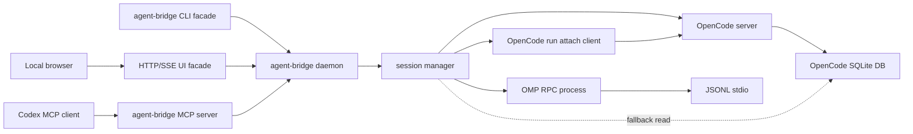

# Agent Bridge Development

This document explains how Agent Bridge is structured, how to test it, and how to release a local plugin build.

## Project Layout

```text
agent-bridge/
  .codex-plugin/plugin.json      Codex plugin manifest
  .mcp.json                      MCP server declaration used by the plugin
  scripts/agent-bridge.mjs       MCP server and backend adapter implementation
  skills/agent-bridge/SKILL.md   Instructions Codex should follow when using the bridge
  docs/REQUIREMENTS.md           Product requirements and TODOs
  docs/INSTALLATION.md           Installation and usage guide
  docs/DEVELOPMENT.md            Development notes
  README.md                      User-facing documentation
```

There are no npm dependencies. The runtime uses Node built-ins plus external CLIs:

- `omp`
- `opencode`
- `sqlite3`

## Architecture



Agent Bridge exposes a small MCP tool surface:

- `agent_bridge_open_session`
- `agent_bridge_send_message`
- `agent_bridge_status`
- `agent_bridge_result`
- `agent_bridge_abort`
- `agent_bridge_close_session`
- `agent_bridge_doctor`

The daemon keeps in-memory session objects for its own lifetime. A session is not persisted by Agent Bridge itself.

The MCP server proxies session tools to the local daemon over `~/.agent-bridge/agent-bridge.sock`. The CLI facade uses the same socket. The web UI is an HTTP/SSE server running inside that daemon, so MCP, CLI, and UI all operate on the same session map.

Codex should still use MCP as the primary interface. CLI commands are for humans, CI smoke tests, process cleanup, and debugging.

## Web UI Monitor

`node scripts/agent-bridge.mjs ui` ensures the daemon is running, requests `ui_start`, and prints or opens a localhost URL. The HTTP server listens on `127.0.0.1` only.

The daemon exposes:

```text
GET    /sessions
POST   /sessions
GET    /sessions/:id
POST   /sessions/:id/messages
GET    /sessions/:id/result
GET    /sessions/:id/events
POST   /sessions/:id/abort
DELETE /sessions/:id
POST   /daemon/stop
```

`/sessions/:id/events` is a Server-Sent Events stream. `pushEvent()` stores a compact event on the session and broadcasts a sanitized payload to connected SSE clients. The main output path emits assistant-visible text and status transitions; the Debug panel receives compact JSON with thinking/reasoning-like keys removed.

## Process Lifecycle

Agent Bridge owns every child process it starts and records those process ids in:

```text
~/.agent-bridge/pids/
```

The daemon cleans up active sessions when it receives `SIGTERM`, `SIGINT`, or `SIGHUP`, when stdout closes with `EPIPE`, or when an uncaught exception/unhandled rejection reaches the process boundary. The MCP server no longer owns delegated sessions directly; it proxies to the daemon, then waits for pending async MCP responses before exiting on stdin close.

Normal `agent_bridge_close_session` calls remove the pid record immediately. `agent-bridge stop` closes daemon-owned sessions and their OMP/OpenCode child processes. Process-level shutdown leaves pid records in place after sending `SIGTERM`; this is intentional. If a child ignores termination or Agent Bridge is killed abruptly, the next MCP startup reads those records, verifies that the process command still matches an Agent Bridge backend such as `omp --mode rpc`, `opencode serve`, or `opencode run --attach`, and terminates the recorded process tree. Stale records for already-exited processes are removed.

Pid-record cleanup must treat both `agent-bridge mcp` and `agent-bridge daemon` as live owners. A short-lived MCP process may start while the daemon owns sessions, and cleanup must skip those daemon-owned children instead of terminating active OMP/OpenCode processes.

This cleanup cannot run after `SIGKILL` (`kill -9`) because no Node.js code can execute in that case, but the pid-record sweep on the next startup is designed to catch leftovers from that kind of hard exit.

## OMP Backend

The OMP backend starts:

```sh
omp --mode rpc --no-title --no-extensions --no-rules
```

In read-oriented mode it limits OMP tools:

```sh
--tools read,grep,find,lsp,web_search --approval-mode yolo
```

In write mode it adds:

```sh
--auto-approve --approval-mode yolo
```

The adapter sends JSONL requests over stdin and reads JSONL responses/events from stdout. It uses OMP RPC commands such as `prompt`, `get_state`, `get_last_assistant_text`, and `abort`.

## OpenCode Backend

OpenCode does not currently provide an OMP-style `--mode rpc` stdio protocol. The backend starts:

```sh
opencode serve --hostname 127.0.0.1 --port <free-port>
```

Each turn sends a message with:

```sh
opencode run --attach http://127.0.0.1:<port> --dir <cwd> --format json <message>
```

When OpenCode stdout includes only partial JSON events, the adapter reads the final assistant text from OpenCode's local SQLite database:

```text
$OPENCODE_DB_PATH
~/.local/share/opencode/opencode.db
```

This fallback is read-only. It queries `message` and `part`, finds the latest assistant message for the OpenCode session id, and joins text parts.

## Local Checks

Run these before installing or publishing:

```sh
node --check scripts/agent-bridge.mjs
node scripts/agent-bridge.mjs doctor
node scripts/agent-bridge.mjs cleanup
printf '%s\n' '{"jsonrpc":"2.0","id":1,"method":"tools/list","params":{}}' | node scripts/agent-bridge.mjs mcp
```

If you have the plugin validator from Codex's plugin creator skill:

```sh
python /path/to/validate_plugin.py .
```

## Codex CLI Smoke Tests

After installing the plugin, verify Codex can call it:

```sh
codex mcp list | rg agent-bridge
codex plugin list | rg agent-bridge
```

Minimal non-mutating session test:

```sh
codex -a never -s danger-full-access -C "$PWD" exec --json --skip-git-repo-check \
  'Use only the agent_bridge MCP tools. Call agent_bridge_doctor. Open an opencode session with write=false, call status, close it, and report the session id.'
```

Real message exchange test:

```sh
codex -a never -s danger-full-access -C "$PWD" exec --json --skip-git-repo-check \
  'Use only agent_bridge MCP tools. Open an opencode session with write=false. Send: "Only reply EXACT_OPENCODE_BRIDGE_OK." with wait=true. Close the session and report whether the exact text was returned.'
```

## Agent Bridge CLI Facade Tests

The facade auto-starts a daemon when a session command needs it:

```sh
node scripts/agent-bridge.mjs cleanup --json
node scripts/agent-bridge.mjs start --json
node scripts/agent-bridge.mjs ui --no-open --json
curl -fsS <ui-url>/health
curl -fsS <ui-url>/sessions
node scripts/agent-bridge.mjs sessions --json
node scripts/agent-bridge.mjs open --agent omp --cwd "$PWD" --json
node scripts/agent-bridge.mjs status <session_id> --json
node scripts/agent-bridge.mjs close <session_id> --json
node scripts/agent-bridge.mjs stop --json
```

For a real message exchange test, send a bounded prompt and close the session afterward:

```sh
node scripts/agent-bridge.mjs open --agent opencode --cwd "$PWD" --json
node scripts/agent-bridge.mjs send <session_id> "Only reply EXACT_OPENCODE_BRIDGE_OK. Do not read or write files." --wait --json
node scripts/agent-bridge.mjs close <session_id> --json
```

UI/API sharing checks:

```sh
# CLI-opened sessions must appear through HTTP.
node scripts/agent-bridge.mjs open --agent omp --cwd "$PWD" --json
curl -fsS <ui-url>/sessions

# UI-opened sessions must appear through CLI.
curl -fsS -X POST <ui-url>/sessions \
  -H 'content-type: application/json' \
  --data '{"agent":"omp","cwd":"'"$PWD"'","write":false}'
node scripts/agent-bridge.mjs sessions --json

# MCP-opened sessions must appear through HTTP because MCP proxies to the daemon.
printf '%s\n' \
  '{"jsonrpc":"2.0","id":1,"method":"initialize","params":{"protocolVersion":"2025-06-18"}}' \
  '{"jsonrpc":"2.0","id":2,"method":"tools/call","params":{"name":"agent_bridge_open_session","arguments":{"agent":"omp","cwd":"'"$PWD"'","write":false}}}' \
  | node scripts/agent-bridge.mjs mcp
curl -fsS <ui-url>/sessions
```

SSE realtime checks should subscribe to `/sessions/:id/events`, send a short bounded prompt, and assert that the stream receives:

- a `running` status
- assistant-visible text
- an `idle` status

## Personal Marketplace Example

Codex plugin installation expects a marketplace entry. A minimal personal marketplace can look like this:

```json
{
  "name": "personal",
  "interface": {
    "displayName": "Personal"
  },
  "plugins": [
    {
      "name": "agent-bridge",
      "source": {
        "source": "local",
        "path": "./plugins/agent-bridge"
      },
      "policy": {
        "installation": "AVAILABLE",
        "authentication": "ON_INSTALL"
      },
      "category": "Productivity"
    }
  ]
}
```

With that marketplace configured:

```sh
mkdir -p "$HOME/plugins"
ln -sfn /absolute/path/to/agent-bridge "$HOME/plugins/agent-bridge"
codex plugin add agent-bridge@personal
```

## Release Checklist

1. Update `BRIDGE_VERSION` in `scripts/agent-bridge.mjs`.
2. Update `.codex-plugin/plugin.json`.
3. Run syntax and plugin validation.
4. Run the CLI facade and UI/SSE smoke tests if CLI, daemon, MCP proxy, or UI code changed.
5. Run the process-cleanup smoke test if lifecycle code changed.
6. Reinstall the plugin through Codex.
7. Run the Codex CLI smoke tests.
8. Confirm no delegated backend processes are left running:

```sh
ps -axo pid,ppid,command | rg 'agent-bridge|omp --mode rpc|opencode serve' || true
```

## Security Notes

- Never commit GitHub tokens, API keys, `.env` files, logs, or local auth files.
- Keep public repository config portable. Avoid committing machine-specific paths such as `/Users/<name>/...`.
- Keep `write: false` unless the user explicitly requested delegated edits.
- Treat `write: true` as high privilege. OMP and OpenCode both receive auto-approval style flags in write mode.
- Close sessions when finished.

## Troubleshooting

If `agent_bridge_doctor` cannot find a backend, set `OMP_BIN` or `OPENCODE_BIN`.

If OpenCode returns `text: null`, check that `sqlite3` is available and that `OPENCODE_DB_PATH` points to the active OpenCode database.

If Codex cannot see the MCP server, reinstall the plugin and check:

```sh
codex mcp list
codex plugin list
```
