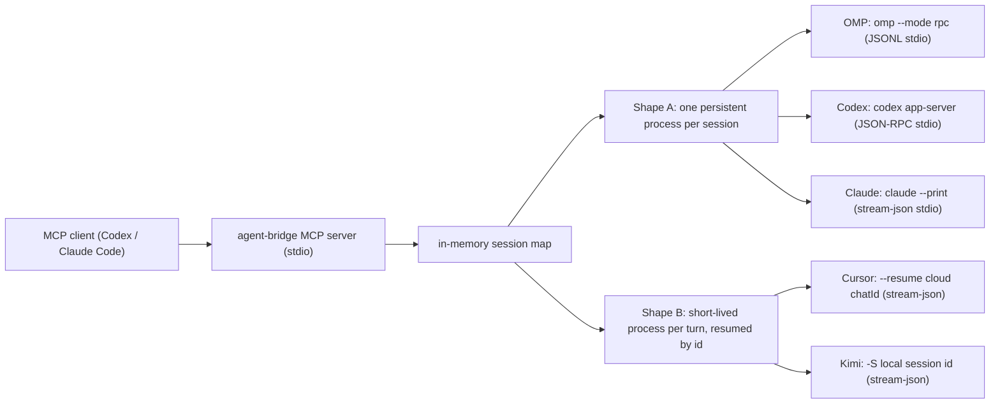

# Agent Bridge Development

This document explains how Agent Bridge is structured, how to test it, and how to cut a release.

## Project Layout

```text
agent-bridge/
  .mcp.json                          Project-scoped MCP server declaration (auto-loaded when a client runs in the repo)
  scripts/agent-bridge.mjs           MCP server and backend adapter implementation
  skills/agent-bridge/SKILL.md       Bridge usage guide the delegating agent follows
  skills/agent-bridge-dev/SKILL.md   Optional companion: delegated-role dev/review/design/debug orchestration
  docs/REQUIREMENTS.md               Product requirements and TODOs
  docs/INSTALLATION.md               Installation and usage guide
  docs/DEVELOPMENT.md                Development notes
  README.md                          User-facing documentation
```

There are no npm dependencies. The runtime uses Node built-ins plus external CLIs. Agent Bridge only bridges to these — it never installs them, and each is optional (a backend that is not installed is reported by `doctor` as `missing` / `available:false`; it does not break the server):

- `omp`
- `codex`
- `claude`
- `cursor` (the `agent` CLI; **Windows-only**)
- `kimi` (the native `kimi.exe`; **Windows-only**)

## Architecture

Backends come in two process shapes. **Shape A** holds one persistent child for the whole session; **Shape B** holds no process between turns — each turn spawns a short-lived child that exits when the turn ends, and continuity comes from resuming a session id.



The Shape B split matters downstream: a Shape B session is `healthy` and idle with **no pid at all** between turns, so liveness cannot be derived from "is the child alive?" the way it is for Shape A. Cursor's resume id is a **cloud** `chatId` (minted by a create-chat round-trip); Kimi's is a **local** session id that the CLI itself mints on the first turn (no create-chat).

Agent Bridge exposes a small MCP tool surface:

- `agent_bridge_open_session`
- `agent_bridge_send_message`
- `agent_bridge_status`
- `agent_bridge_result`
- `agent_bridge_abort`
- `agent_bridge_close_session`
- `agent_bridge_doctor`

Each `agent-bridge mcp` process keeps its own in-memory session map for its own lifetime; one MCP client equals one MCP process equals one session map. A session is not persisted by Agent Bridge itself, and sessions are never shared across clients.

The MCP server owns its sessions directly: `callTool` invokes `openSession`/`sendMessage`/… in-process and spawns the backends as children of the MCP process — OMP/Codex/Claude as persistent processes held for the session's lifetime, Cursor/Kimi as short-lived per-turn processes (see Architecture: Shape A vs Shape B). There is no background daemon, no Unix socket, and no `requestDaemon` proxy. The bridge speaks MCP over stdio only and opens no network listener of any kind. As of v0.7.0 the entire HTTP/SSE Web UI stack was removed (see [ARCHITECTURE.md](ARCHITECTURE.md)); `session.events` is still buffered to back `recentEvents` in `status`/`result`, but it is no longer broadcast anywhere.

Sessions are managed exclusively through the MCP tools. The CLI exposes only `mcp` (the server entrypoint) plus `doctor` and `cleanup` helpers.

## Process Lifecycle

Agent Bridge owns every child process it starts and records those process ids in:

```text
~/.agent-bridge/pids/
```

The MCP server owns its sessions directly and cleans up every active session when it receives `SIGTERM`, `SIGINT`, or `SIGHUP`, when stdin closes (the client exited), when stdout closes with `EPIPE`, or when an uncaught exception/unhandled rejection reaches the process boundary. On stdin close it waits for pending async MCP responses before exiting. A clean exit (code 0) also removes that run's log directory `~/.agent-bridge/logs/<runId>/`; a crash (code !== 0) keeps it for debugging. Each run dir carries an `owner` file holding the server's pid, so the next server's startup sweep (and `cleanup`) can reclaim `logs/<runId>/` dirs whose owning server is gone — abandoned crash dirs do not accumulate.

Normal `agent_bridge_close_session` calls remove the pid record immediately. Process-level shutdown leaves pid records in place after sending `SIGTERM`; this is intentional. If a child ignores termination or Agent Bridge is killed abruptly, the next MCP startup reads those records, verifies that the process command still matches an Agent Bridge backend such as `omp --mode rpc` or `codex app-server`, and terminates the recorded process tree. Stale records for already-exited processes are removed.

`close_session` is fire-and-forget by design: it SIGTERMs the backend, schedules a 3s force-kill backstop, and returns immediately so a bulk close stays cheap. The backend process tree therefore dies *after* the call returns. On Windows this matters to any caller that deletes the session's `cwd` right after closing: the OMP/Codex backend is a process **tree**, and a child can hold that directory open for a few hundred ms past close — *even after the root process is gone* — so an immediate `rmdir`/`fs.rm` races the teardown and hits `EPERM` (the dir is left in `STATUS_DELETE_PENDING`). Waiting only for the root process to exit is NOT enough: a surviving child still holds the handle (verified — even confirming the root pid is OS-reaped still EPERM'd). The robust contract is to **poll-and-retry the delete itself** — a fresh `fs.rm` after a short async sleep, which lands cleanly once the tree has fully released the directory (~0.5–1s). The real-backend e2e harness (`docs/repro-mcp-hang/e2e-real.mjs`, step 7) demonstrates this pattern. POSIX is unaffected — it lets you unlink a directory a process is still `cwd`'d into.

Pid-record cleanup treats only `agent-bridge mcp` as a live owner (the owner-alive check matches `\bmcp\b` in the owning process command). A record whose owning MCP process is still running is skipped so its active OMP/Codex children are never terminated; `cleanup` only reaps orphans whose owning MCP server is gone (SIGTERM followed by a SIGKILL backstop), and also deletes abandoned `logs/<runId>/` dirs from those dead servers.

This cleanup cannot run after `SIGKILL` (`kill -9`) because no Node.js code can execute in that case, but the pid-record sweep on the next startup is designed to catch leftovers from that kind of hard exit.

## OMP Backend

The OMP backend starts:

```sh
omp --mode rpc --no-title --no-extensions --no-rules
```

In read-oriented mode it limits OMP tools:

```sh
--tools read,grep,find,lsp,web_search --approval-mode yolo
```

In write mode it adds:

```sh
--auto-approve --approval-mode yolo
```

The adapter sends JSONL requests over stdin and reads JSONL responses/events from stdout. It uses OMP RPC commands such as `prompt`, `get_state`, `get_last_assistant_text`, and `abort`.

## Local Checks

Run these before installing or publishing:

```sh
node --check scripts/agent-bridge.mjs
node scripts/agent-bridge.mjs doctor
node scripts/agent-bridge.mjs cleanup
printf '%s\n' '{"jsonrpc":"2.0","id":1,"method":"tools/list","params":{}}' | node scripts/agent-bridge.mjs mcp
```

## End-to-End Test (real backends)

`docs/repro-mcp-hang/e2e-real.mjs` drives the working-tree MCP server over real JSON-RPC stdio against **real `omp` + `codex`** and asserts the full delegated-session surface: registry dispatch (open both backends), `wait` mode all/any across both backend types, session reuse, `status` refresh, `abort` + settle, a `write: true` file edit in a temp dir, `assertAgent` rejection of a bad agent, and clean shutdown. Unlike the `repro-*.mjs` (which use the fake-omp stub for zero model usage), this spends **real model tokens** and needs both backends on `PATH`; it SKIPs cleanly (exit 0) if either is missing. Transient backend network blips can flake individual scenarios — re-run to confirm.

```sh
node docs/repro-mcp-hang/e2e-real.mjs   # prints PASS/FAIL per scenario, then a tally
```

## Codex CLI Smoke Tests

After registering the MCP server, verify Codex can call it:

```sh
codex mcp list | rg agent-bridge
```

Minimal non-mutating session test:

```sh
codex -a never -s danger-full-access -C "$PWD" exec --json --skip-git-repo-check \
  'Use only the agent_bridge MCP tools. Call agent_bridge_doctor. Open a codex session with write=false, call status, close it, and report the session id.'
```

Real message exchange test:

```sh
codex -a never -s danger-full-access -C "$PWD" exec --json --skip-git-repo-check \
  'Use only agent_bridge MCP tools. Open a codex session with write=false. Send: "Only reply EXACT_CODEX_BRIDGE_OK." with wait=true. Close the session and report whether the exact text was returned.'
```

## MCP Stdio Verification

Sessions are driven only through the MCP tools over stdio. Open and close a session in one MCP process by piping JSON-RPC frames:

```sh
printf '%s\n' \
  '{"jsonrpc":"2.0","id":1,"method":"initialize","params":{"protocolVersion":"2025-06-18"}}' \
  '{"jsonrpc":"2.0","id":2,"method":"tools/call","params":{"name":"agent_bridge_open_session","arguments":{"agent":"omp","cwd":"'"$PWD"'","write":false}}}' \
  '{"jsonrpc":"2.0","id":3,"method":"tools/call","params":{"name":"agent_bridge_status","arguments":{}}}' \
  | node scripts/agent-bridge.mjs mcp
```

For a real message exchange, add a `agent_bridge_send_message` (with `wait: true` for a quick turn) and an `agent_bridge_close_session` frame after the open frame.

### No listening port

The bridge speaks MCP over stdio only and must never open a network listener. With a server running, confirm it holds no socket:

```sh
node scripts/agent-bridge.mjs mcp &   # or run it under a client
lsof -p $! -a -i 2>/dev/null || echo "no network sockets (expected)"
```

### Per-run log dir removed on clean exit

Each MCP server gets `~/.agent-bridge/logs/<runId>/`. After a clean exit (stdin close / signal) that run dir should be gone; only a crash (exit code != 0) leaves it for debugging:

```sh
ls "$HOME/.agent-bridge/logs/"   # before: a <runId> dir exists while the server runs
# after a clean shutdown, that <runId> dir is removed
```

### Signal kills backend children

Send `SIGTERM` (or close stdin) to a running server that has an open session and confirm its `omp --mode rpc` / `codex app-server` children exit too:

```sh
ps -axo pid,ppid,command | rg 'omp --mode rpc|codex app-server' || true
```

### cleanup reaps orphans

Hard-kill a server (`kill -9`) with an open session so the in-process cleanup cannot run, then confirm `cleanup` reaps the orphaned children whose owning MCP server is gone:

```sh
node scripts/agent-bridge.mjs cleanup --json
ps -axo pid,ppid,command | rg 'omp --mode rpc|codex app-server' || true
```

## Release Checklist

1. Update `BRIDGE_VERSION` in `scripts/agent-bridge.mjs`.
2. Run syntax validation (`node --check scripts/agent-bridge.mjs`).
3. Run the MCP stdio verification (including the no-listening-port check) if MCP or session code changed.
4. Run the process-cleanup / per-run-log-dir checks if lifecycle code changed.
5. Restart the client so it reloads the running MCP server.
6. Run the Codex CLI smoke tests.
7. Confirm no delegated backend processes are left running:

```sh
ps -axo pid,ppid,command | rg 'agent-bridge|omp --mode rpc|codex app-server' || true
```

## Security Notes

- Never commit GitHub tokens, API keys, `.env` files, logs, or local auth files.
- Keep public repository config portable. Avoid committing machine-specific paths such as `/Users/<name>/...`.
- Keep `write: false` unless the user explicitly requested delegated edits.
- Treat `write: true` as high privilege, but note the mapping is per backend and only three of the five have a distinct high-privilege switch:
  - **OMP** — `--auto-approve --approval-mode yolo`.
  - **Codex** — `sandbox: workspace-write` (on **Windows**, `danger-full-access`; see the apply_patch note in `scripts/agent-bridge.mjs`).
  - **Claude** — `--permission-mode bypassPermissions`.
  - **Cursor / Kimi** — **no separate high-privilege switch.** `read` and `write` share the exact same launch (cursor's `--force`; kimi's single `kimi.exe` invocation); the only difference is that `read` prepends a soft "read-only investigation" instruction which `write` omits. So their `write` is not *more* OS privilege — it is the same privilege with the restraint removed, and their `read` is correspondingly not a hard no-write guarantee.
- Close sessions when finished.

## Troubleshooting

If `agent_bridge_doctor` cannot find a backend, set the matching override: `OMP_BIN`, `CODEX_BIN`, `CLAUDE_BIN`, `CURSOR_AGENT_BIN`, or `KIMI_BIN` (which must point at a native `kimi.exe`, never a `.cmd`/`.bat` shim).

If Codex cannot see the MCP server, re-add it (`codex mcp add agent-bridge -- node "<REPO>/scripts/agent-bridge.mjs" mcp`), restart Codex, and check:

```sh
codex mcp list
```
