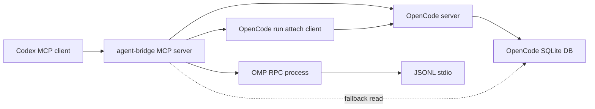

# Agent Bridge Development

This document explains how Agent Bridge is structured, how to test it, and how to release a local plugin build.

## Project Layout

```text
agent-bridge/
  .codex-plugin/plugin.json      Codex plugin manifest
  .mcp.json                      MCP server declaration used by the plugin
  scripts/agent-bridge.mjs       MCP server and backend adapter implementation
  skills/agent-bridge/SKILL.md   Instructions Codex should follow when using the bridge
  docs/DEVELOPMENT.md            Development notes
  README.md                      User-facing documentation
```

There are no npm dependencies. The runtime uses Node built-ins plus external CLIs:

- `omp`
- `opencode`
- `sqlite3`

## Architecture



Agent Bridge exposes a small MCP tool surface:

- `agent_bridge_open_session`
- `agent_bridge_send_message`
- `agent_bridge_status`
- `agent_bridge_result`
- `agent_bridge_abort`
- `agent_bridge_close_session`
- `agent_bridge_doctor`

The bridge keeps in-memory session objects for the lifetime of the MCP server process. A session is not persisted by Agent Bridge itself.

## OMP Backend

The OMP backend starts:

```sh
omp --mode rpc --no-title --no-extensions --no-rules
```

In read-oriented mode it limits OMP tools:

```sh
--tools read,grep,find,lsp,web_search --approval-mode yolo
```

In write mode it adds:

```sh
--auto-approve --approval-mode yolo
```

The adapter sends JSONL requests over stdin and reads JSONL responses/events from stdout. It uses OMP RPC commands such as `prompt`, `get_state`, `get_last_assistant_text`, and `abort`.

## OpenCode Backend

OpenCode does not currently provide an OMP-style `--mode rpc` stdio protocol. The backend starts:

```sh
opencode serve --hostname 127.0.0.1 --port <free-port>
```

Each turn sends a message with:

```sh
opencode run --attach http://127.0.0.1:<port> --dir <cwd> --format json <message>
```

When OpenCode stdout includes only partial JSON events, the adapter reads the final assistant text from OpenCode's local SQLite database:

```text
$OPENCODE_DB_PATH
~/.local/share/opencode/opencode.db
```

This fallback is read-only. It queries `message` and `part`, finds the latest assistant message for the OpenCode session id, and joins text parts.

## Local Checks

Run these before installing or publishing:

```sh
node --check scripts/agent-bridge.mjs
node scripts/agent-bridge.mjs doctor
printf '%s\n' '{"jsonrpc":"2.0","id":1,"method":"tools/list","params":{}}' | node scripts/agent-bridge.mjs mcp
```

If you have the plugin validator from Codex's plugin creator skill:

```sh
python /path/to/validate_plugin.py .
```

## Codex CLI Smoke Tests

After installing the plugin, verify Codex can call it:

```sh
codex mcp list | rg agent-bridge
codex plugin list | rg agent-bridge
```

Minimal non-mutating session test:

```sh
codex -a never -s danger-full-access -C "$PWD" exec --json --skip-git-repo-check \
  'Use only the agent_bridge MCP tools. Call agent_bridge_doctor. Open an opencode session with write=false, call status, close it, and report the session id.'
```

Real message exchange test:

```sh
codex -a never -s danger-full-access -C "$PWD" exec --json --skip-git-repo-check \
  'Use only agent_bridge MCP tools. Open an opencode session with write=false. Send: "Only reply EXACT_OPENCODE_BRIDGE_OK." with wait=true. Close the session and report whether the exact text was returned.'
```

## Personal Marketplace Example

Codex plugin installation expects a marketplace entry. A minimal personal marketplace can look like this:

```json
{
  "name": "personal",
  "interface": {
    "displayName": "Personal"
  },
  "plugins": [
    {
      "name": "agent-bridge",
      "source": {
        "source": "local",
        "path": "./plugins/agent-bridge"
      },
      "policy": {
        "installation": "AVAILABLE",
        "authentication": "ON_INSTALL"
      },
      "category": "Productivity"
    }
  ]
}
```

With that marketplace configured:

```sh
mkdir -p "$HOME/plugins"
ln -sfn /absolute/path/to/agent-bridge "$HOME/plugins/agent-bridge"
codex plugin add agent-bridge@personal
```

## Release Checklist

1. Update `BRIDGE_VERSION` in `scripts/agent-bridge.mjs`.
2. Update `.codex-plugin/plugin.json`.
3. Run syntax and plugin validation.
4. Reinstall the plugin through Codex.
5. Run the Codex CLI smoke tests.
6. Confirm no delegated backend processes are left running:

```sh
ps -axo pid,ppid,command | rg 'agent-bridge|omp --mode rpc|opencode serve' || true
```

## Security Notes

- Never commit GitHub tokens, API keys, `.env` files, logs, or local auth files.
- Keep public repository config portable. Avoid committing machine-specific paths such as `/Users/<name>/...`.
- Keep `write: false` unless the user explicitly requested delegated edits.
- Treat `write: true` as high privilege. OMP and OpenCode both receive auto-approval style flags in write mode.
- Close sessions when finished.

## Troubleshooting

If `agent_bridge_doctor` cannot find a backend, set `OMP_BIN` or `OPENCODE_BIN`.

If OpenCode returns `text: null`, check that `sqlite3` is available and that `OPENCODE_DB_PATH` points to the active OpenCode database.

If Codex cannot see the MCP server, reinstall the plugin and check:

```sh
codex mcp list
codex plugin list
```
