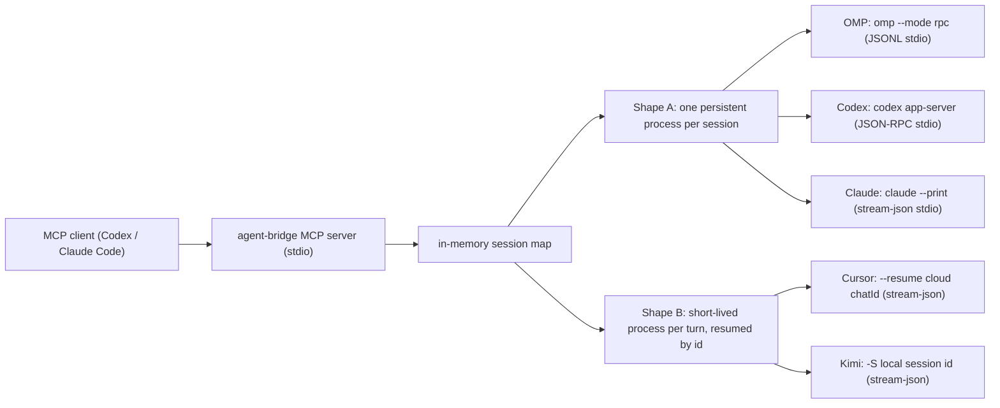

# Agent Bridge Development

This document explains how Agent Bridge is structured, how to test it, and how to cut a release.

## Project Layout

```text
agent-bridge/
  .mcp.json                          Project-scoped MCP server declaration (auto-loaded when a client runs in the repo)
  scripts/                           产品代码：MCP server 与后端适配、观测快照 writer
  skills/                            skill 包 —— 只放一次调用里真会被打开的东西（见下）
  tests/                             全部测试与假后端桩（零消耗的 repro-* / 真花钱的 e2e-* / 页面侧 test-viz-*）
  tools/                             开发用生成器（产物提交进仓，跑 skill 时用不到）
  docs/                              规范、设计稿、复盘、安装与开发说明
  README.md                          User-facing documentation
```

四条目录判据，一条比一条硬：

| 目录 | 判据 |
|---|---|
| `scripts/` | 装了 agent-bridge 的人在跑的**产品代码** |
| `skills/` | **一次 skill 调用里真会被打开的东西**：`SKILL.md` + `tools/` `templates/` `examples/` `roles/` `modes/` + 观测台的 `serve.mjs` / `index.html` / `reconcile.mjs` / `sample/` |
| `tests/` | 验证用的一切。**不进 `skills/`** —— 否则 agent 顺手列一下 skill 目录，就可能把上千行测试读进上下文，而它在那次调用里一个字都用不上 |
| `tools/` | 生成器（`build-session-viz-index.mjs` 造页面、`build-graph-viz-sample.mjs` 造冻结样例、`regen-loop-viz-demo.mjs`）。它们的**产物**在 `skills/` 里，**它们自己**不在 |

> `tests/` 以前叫 `docs/repro-mcp-hang/` —— 名字两头都不对：它不是文档，也早就不只是那次 MCP
> 卡死的复现了（59 个文件、覆盖全部后端与两个观测台）。2026-07-31 改名。
>
> ⚠️ 目录深度从两层变一层，所以 `tests/` 里所有 `../../` 都降成了 `../`。
> 新加测试时注意：`../skills/…`、`../scripts/…`、`path.resolve(HERE, "..")` 才是仓根。

There are no npm dependencies. The runtime uses Node built-ins plus external CLIs. Agent Bridge only bridges to these — it never installs them, and each is optional (a backend that is not installed is reported by `doctor` as `missing` / `available:false`; it does not break the server):

- `omp`
- `codex`
- `claude`
- `cursor` (the `agent` CLI; **Windows-only**)
- `kimi` (the native `kimi.exe`; **Windows-only**)

## Architecture

Backends come in two process shapes. **Shape A** holds one persistent child for the whole session; **Shape B** holds no process between turns — each turn spawns a short-lived child that exits when the turn ends, and continuity comes from resuming a session id.


```mermaid
flowchart LR
  Client["MCP client (Codex / Claude Code)"] --> Bridge["agent-bridge MCP server (stdio)"]
  Bridge --> Sessions["in-memory session map"]
  Sessions --> ShapeA["Shape A: one persistent process per session"]
  Sessions --> ShapeB["Shape B: short-lived process per turn, resumed by id"]
  ShapeA --> OMP["OMP: omp --mode rpc (JSONL stdio)"]
  ShapeA --> CDX["Codex: codex app-server (JSON-RPC stdio)"]
  ShapeA --> CLA["Claude: claude --print (stream-json stdio)"]
  ShapeB --> CUR["Cursor: --resume cloud chatId (stream-json)"]
  ShapeB --> KIM["Kimi: -S local session id (stream-json)"]
```

The Shape B split matters downstream: a Shape B session is `healthy` and idle with **no pid at all** between turns, so liveness cannot be derived from "is the child alive?" the way it is for Shape A. Cursor's resume id is a **cloud** `chatId` (minted by a create-chat round-trip); Kimi's is a **local** session id that the CLI itself mints on the first turn (no create-chat).

Agent Bridge exposes a small MCP tool surface:

- `agent_bridge_open_session`
- `agent_bridge_send_message`
- `agent_bridge_status`
- `agent_bridge_result`
- `agent_bridge_abort`
- `agent_bridge_close_session`
- `agent_bridge_doctor`

Each `agent-bridge mcp` process keeps its own in-memory session map for its own lifetime; one MCP client equals one MCP process equals one session map. A session is not persisted by Agent Bridge itself, and sessions are never shared across clients.

The MCP server owns its sessions directly: `callTool` invokes `openSession`/`sendMessage`/… in-process and spawns the backends as children of the MCP process — OMP/Codex/Claude as persistent processes held for the session's lifetime, Cursor/Kimi as short-lived per-turn processes (see Architecture: Shape A vs Shape B). There is no background daemon, no Unix socket, and no `requestDaemon` proxy. The bridge speaks MCP over stdio only and opens no network listener of any kind. As of v0.7.0 the entire HTTP/SSE Web UI stack was removed (see [ARCHITECTURE.md](ARCHITECTURE.md)); `session.events` is still buffered to back `recentEvents` in `status`/`result`, but it is no longer broadcast anywhere.

Sessions are managed exclusively through the MCP tools. The CLI exposes only `mcp` (the server entrypoint) plus `doctor` and `cleanup` helpers.

## Process Lifecycle

Agent Bridge owns every child process it starts and records those process ids in:

```text
~/.agent-bridge/pids/
```

The MCP server owns its sessions directly and cleans up every active session when it receives `SIGTERM`, `SIGINT`, or `SIGHUP`, when stdin closes (the client exited), when stdout closes with `EPIPE`, or when an uncaught exception/unhandled rejection reaches the process boundary. On stdin close it waits for pending async MCP responses before exiting. A clean exit (code 0) also removes that run's log directory `~/.agent-bridge/logs/<runId>/`; a crash (code !== 0) keeps it for debugging. Each run dir carries an `owner` file holding the server's pid, so the next server's startup sweep (and `cleanup`) can reclaim `logs/<runId>/` dirs whose owning server is gone — abandoned crash dirs do not accumulate.

Normal `agent_bridge_close_session` calls remove the pid record immediately. Process-level shutdown leaves pid records in place after sending `SIGTERM`; this is intentional. If a child ignores termination or Agent Bridge is killed abruptly, the next MCP startup reads those records, verifies that the process command still matches an Agent Bridge backend such as `omp --mode rpc` or `codex app-server`, and terminates the recorded process tree. Stale records for already-exited processes are removed.

`close_session` refuses by default when the session's turn is still running (`{blocked:true, runningSessionIds}`; the bulk form is an atomic preflight — one running session blocks all of them) — pass `force:true` to close anyway. Once it does close, it is fire-and-forget by design: it SIGTERMs the backend, schedules a 3s force-kill backstop, and returns immediately so a bulk close stays cheap. The backend process tree therefore dies *after* the call returns. On Windows this matters to any caller that deletes the session's `cwd` right after closing: the OMP/Codex backend is a process **tree**, and a child can hold that directory open for a few hundred ms past close — *even after the root process is gone* — so an immediate `rmdir`/`fs.rm` races the teardown and hits `EPERM` (the dir is left in `STATUS_DELETE_PENDING`). Waiting only for the root process to exit is NOT enough: a surviving child still holds the handle (verified — even confirming the root pid is OS-reaped still EPERM'd). The robust contract is to **poll-and-retry the delete itself** — a fresh `fs.rm` after a short async sleep, which lands cleanly once the tree has fully released the directory (~0.5–1s). The real-backend e2e harness (`tests/e2e-real.mjs`, step 7) demonstrates this pattern. POSIX is unaffected — it lets you unlink a directory a process is still `cwd`'d into.

Pid-record cleanup treats only `agent-bridge mcp` as a live owner (the owner-alive check matches `\bmcp\b` in the owning process command). A record whose owning MCP process is still running is skipped so its active OMP/Codex children are never terminated; `cleanup` only reaps orphans whose owning MCP server is gone (SIGTERM followed by a SIGKILL backstop), and also deletes abandoned `logs/<runId>/` dirs from those dead servers.

This cleanup cannot run after `SIGKILL` (`kill -9`) because no Node.js code can execute in that case, but the pid-record sweep on the next startup is designed to catch leftovers from that kind of hard exit.

## OMP Backend

The OMP backend starts:

```sh
omp --mode rpc --no-title --no-extensions --no-rules
```

In read-oriented mode it limits OMP tools:

```sh
--tools read,grep,find,lsp,web_search --approval-mode yolo
```

In write mode it adds:

```sh
--auto-approve --approval-mode yolo
```

The adapter sends JSONL requests over stdin and reads JSONL responses/events from stdout. It uses OMP RPC commands such as `prompt`, `get_state`, `get_last_assistant_text`, and `abort`.

## Local Checks

Run these before installing or publishing:

```sh
node --check scripts/agent-bridge.mjs
node scripts/agent-bridge.mjs doctor
node scripts/agent-bridge.mjs cleanup
printf '%s\n' '{"jsonrpc":"2.0","id":1,"method":"tools/list","params":{}}' | node scripts/agent-bridge.mjs mcp
```

## 字节合同（改 writer / viewer 之前先读）

这两份是**规范**，不是说明：落到磁盘、管道、SSE 上的字节、顺序、含义。
写产生方或写页面的人只读它就够，不用回头翻 DESIGN；两边打架以它为准，回去把 DESIGN 改对。

| 合同 | 管的是 | 谁按它施工 |
|---|---|---|
| `docs/EVENTS-graph.md` | graph 观测台的 `transcript.jsonl` 事件流 | `skills/agent-bridge-graph/tools/viz-events.mjs`（写）· `viz/serve.mjs` + `viz/index.html`（读） |
| `docs/STATE-session-viz.md` | 委托会话观测台的双槽快照 | `scripts/viz-writer.mjs`（写）· `skills/agent-bridge/viz/serve.mjs` + `index.html`（读） |

⚠️ **它们刻意不在 `skills/` 下面**：skill 目录只放一次调用里真会被打开的东西。
这两份合同的读者是改 agent-bridge 的人，不是跑 skill 的 agent。

> 对照：`skills/agent-bridge-loop/EVENTS.md` 与 `skills/agent-bridge-roundtable/EVENTS.md`
> **留在各自 skill 目录里**，因为那两个 skill 的事件是**主控 agent 自己 append 的**
> （「单 writer = 你」「桥不替你写事件」），跑的时候要照着它写 —— 那是运行时资产，不是开发文档。

## Skill 回归测试（graph / 两个观测台）

假后端，零消耗，**推送前必过**：

```sh
node tests/repro-graph-node.mjs        # 环节生命周期 / 失败三档 / 幂等 / 零残留
node tests/repro-graph-worktree.mjs    # write 隔离 / 基线闸 / 复用闸 / 并发闸
node tests/repro-viz-events.mjs        # 事件 writer：schema / 有界化 / 半行安全
node tests/repro-viz-graph.mjs         # graph 作用域与归档写入器
node tests/repro-graph-conversation.mjs # 多轮对话：轮的生命周期 / 会话毒化 / 记忆边界
node tests/repro-graph-viz.mjs         # viz 开着时的事件流 / SSE / /file 四道闸
node tests/test-viz-graph.mjs          # graph 页面这一侧：事件流 → 页面上写了什么

node tests/repro-viz-writer.mjs        # 会话快照 writer：双槽 / 有界队列 / 降级三处同步
node tests/repro-viz-bridge.mjs        # 桥真的按合同调 writer 了吗（含开服时孤儿目录回收）
node tests/test-viz-session.mjs        # 会话页面这一侧：快照 → 页面上写了什么
```

⚠️ `repro-graph-viz` 与 `tests/test-viz-graph.mjs` **都**会跑
`tests/contract-invariants-graph.mjs` —— 合同里那些**跨字段的等式**
（「这两处 sha256 必须相等」「这个字段只在那个字段不是 present 时才许出现」）。
它**刻意不 import `skills/agent-bridge-graph/tools/viz-events.mjs`**：schema 只管单个字段的形状，
拿写方的 schema 去验写方造的事件，验的只是"我和我自己一致"。
前者验**每一次真跑出来的 transcript**，后者验**冻结样例** ——
写方与样例任何一侧漂离合同，当场变红。
（会话观测台那一侧对应的是 `tests/contract-invariants-session.mjs`。）

⚠️ **等式不等于对账。** `run:final.counts` 那条不变式只验**总和**
（总数 = 各档相加）。实测踩过：样例里手写的 counts 把两个 `unknown` 记成了 `ok`，
一档多 2、另一档少 2，**和还是 21**，恒等式全程绿灯。
汇总数字必须**逐档**跟原始事件对账，光验总和的检查是有洞的。

⚠️ **"我算的指纹只覆盖我自己的输入"，碰上"结果靠文件路径传"就是一个洞。**
2026-08-03 修的那个：graph 的 `specHash` 只算环节自己的输入（提问、模型、超时…），
而组合纪律 6 要求下游只写上游产物的**路径**、别贴正文。于是**上游重跑一遍、内容整个换掉，
下游的提问一个字不变，两次指纹一模一样**，`reuseIfSame` 直接命中，端出照着上一版上游写的结论
—— 状态、页面、退出码全都正常。修法是回执上单记一份 `depsState`（跑的那一刻上游的产出摘要），
复用时逐条比。**这一族的通用形状：任何"内容指纹"都要问一句「我把所有会改变这个答案的输入都算进去了吗」，
而"通过引用传进来的东西"最容易被漏掉。**

⚠️ **改坏了东西去考闸门，验完必须还原**——不还原的话，后面那个测试比的是一张被你改坏的记录，
它照样"通过"，但通过的理由是假的。同一批里两条断言就是这么被变异验牙逮出来没牙的：
一条从头到尾没让上游真重跑（那一条要考的恰恰是"重跑但内容没变"），
另一条比的是上一条删坏的回执。**测试之间留下的状态，跟产品里的全局状态一样危险。**

### `probe-*` 与 `orphan-claude`（此前**一份文档都没提过**）

这批是 claude 后端与 doctor 那条线的回归，跟 `repro-*` 同等份量，只是名字前缀不同。
**没被任何清单收录过，于是没人跑** —— `probe-doctor-timeout` 就这么红了很久没人发现
（2026-07-31 修复：加第 4、5 个后端时没同步这份夹具，cursor 去探了真的 CLI）。

零消耗（假后端 / 假二进制，可以随时跑）：

```sh
node tests/probe-doctor-timeout.mjs          # 五个后端的 --version 探针都被超时挡住 + 不留孤儿孙进程
node tests/probe-claude-abort-fallback.mjs   # abort 兜底路径 + 迟到结果被吞掉
node tests/probe-claude-abort-usage-gate.mjs # abort 跨越时 contextUsage 的闸门
node tests/probe-claude-badbin.mjs           # 坏 CLAUDE_BIN 必须让 open 干净失败,不许先报 idle 再死
node tests/probe-claude-effort.mjs           # --effort / --model 到底怎么落到命令行上
```

要**真 claude 在 PATH 上**（会花额度；装不上时自己跳过退 0）：

```sh
node tests/probe-claude-doctor.mjs   # 只探 --version,近乎免费
node tests/probe-claude-open.mjs     # read / write 两档会话都能到 idle
node tests/probe-claude-turn.mjs     # 连发两轮拿结果
node tests/probe-claude-abort.mjs    # 真中断一轮,会话还能接着用
node tests/orphan-claude.mjs         # 桥退出后**绝不**留下活着的 claude(优雅退出 + SIGKILL 两条路)
```

⚠️ `probe-doctor-timeout` 里那份"哪些后端能被造成挂住"的清单要跟着后端数走。
kimi 是例外且**造不出来**：`resolveKimiBin` 刻意只认真名 `kimi.exe` 的原生文件、拒绝 `.cmd` 壳
（prompt 走 argv，经 shim 会绕进 cmd.exe，是注入面）——那条拒绝是安全属性，同时也意味着
不编译一个真 PE 就伪造不出"会挂住的 kimi.exe"。所以它只考到「不可用 + 不拖慢 doctor」，
文件里如实分了档，而不是把断言放宽到所有后端（那会让另外四个一起失去牙）。

**真浏览器** e2e（零消耗，但要 playwright；改了页面之后跑一次）：

```sh
npm i playwright && npx playwright install chromium         # 装在哪个目录都行
PLAYWRIGHT_DIR=<那个目录> node tests/e2e-viz-browser.mjs
```

它同时考 **graph 观测台**和**委托会话观测台**，只问「只有真浏览器答得上来」的问题，
不重复 `test-viz` 已经守住的内容断言。为什么非要它：`test-viz` 是在 **vm 沙箱**里跑页面脚本、
断言吐出来的 HTML 字符串 —— 没有排版引擎、没有命中测试、没有焦点、也没有真的 JS 运行时。
两个真事都是它照不出来的：**推断边"可点开看依据"实测命中率只有 8%**（线宽 1.4px 又是虚线，
命中区就是那条线本身）；**会话观测台调了一个没 export 的函数，每秒抛一次 ReferenceError，
连带把定时刷新整个弄死**。两处的 HTML 字符串都挑不出毛病，一路全绿。
装不上 playwright 时它**如实跳过并退 0**，所以不进推送前的闸。

真后端 e2e（**真花钱**，改了归档布局 / 事件形状 / 页面读法之后跑一次）：

```sh
node tests/e2e-graph-viz.mjs           # 真跑 → 观测台上看到的就是磁盘上那份
node tests/e2e-viz.mjs                 # 会话观测台的真后端一轮
```

## End-to-End Test (real backends)

`tests/e2e-real.mjs` drives the working-tree MCP server over real JSON-RPC stdio against **real `omp` + `codex`** and asserts the full delegated-session surface: registry dispatch (open both backends), `wait` mode all/any across both backend types, session reuse, `status` refresh, `abort` + settle, a `write: true` file edit in a temp dir, `assertAgent` rejection of a bad agent, and clean shutdown. Unlike the `repro-*.mjs` (which use the fake-omp stub for zero model usage), this spends **real model tokens** and needs both backends on `PATH`; it SKIPs cleanly (exit 0) if either is missing. Transient backend network blips can flake individual scenarios — re-run to confirm.

```sh
node tests/e2e-real.mjs   # prints PASS/FAIL per scenario, then a tally
```

## Codex CLI Smoke Tests

After registering the MCP server, verify Codex can call it:

```sh
codex mcp list | rg agent-bridge
```

Minimal non-mutating session test:

```sh
codex -a never -s danger-full-access -C "$PWD" exec --json --skip-git-repo-check \
  'Use only the agent_bridge MCP tools. Call agent_bridge_doctor. Open a codex session with write=false, call status, close it, and report the session id.'
```

Real message exchange test:

```sh
codex -a never -s danger-full-access -C "$PWD" exec --json --skip-git-repo-check \
  'Use only agent_bridge MCP tools. Open a codex session with write=false. Send: "Only reply EXACT_CODEX_BRIDGE_OK." with wait=true. Close the session and report whether the exact text was returned.'
```

## MCP Stdio Verification

Sessions are driven only through the MCP tools over stdio. Open and close a session in one MCP process by piping JSON-RPC frames:

```sh
printf '%s\n' \
  '{"jsonrpc":"2.0","id":1,"method":"initialize","params":{"protocolVersion":"2025-06-18"}}' \
  '{"jsonrpc":"2.0","id":2,"method":"tools/call","params":{"name":"agent_bridge_open_session","arguments":{"agent":"omp","cwd":"'"$PWD"'","write":false}}}' \
  '{"jsonrpc":"2.0","id":3,"method":"tools/call","params":{"name":"agent_bridge_status","arguments":{}}}' \
  | node scripts/agent-bridge.mjs mcp
```

For a real message exchange, add a `agent_bridge_send_message` (with `wait: true` for a quick turn) and an `agent_bridge_close_session` frame after the open frame.

### No listening port

The bridge speaks MCP over stdio only and must never open a network listener. With a server running, confirm it holds no socket:

```sh
node scripts/agent-bridge.mjs mcp &   # or run it under a client
lsof -p $! -a -i 2>/dev/null || echo "no network sockets (expected)"
```

### Per-run log dir removed on clean exit

Each MCP server gets `~/.agent-bridge/logs/<runId>/`. After a clean exit (stdin close / signal) that run dir should be gone; only a crash (exit code != 0) leaves it for debugging:

```sh
ls "$HOME/.agent-bridge/logs/"   # before: a <runId> dir exists while the server runs
# after a clean shutdown, that <runId> dir is removed
```

### Signal kills backend children

Send `SIGTERM` (or close stdin) to a running server that has an open session and confirm its `omp --mode rpc` / `codex app-server` children exit too:

```sh
ps -axo pid,ppid,command | rg 'omp --mode rpc|codex app-server' || true
```

### cleanup reaps orphans

Hard-kill a server (`kill -9`) with an open session so the in-process cleanup cannot run, then confirm `cleanup` reaps the orphaned children whose owning MCP server is gone:

```sh
node scripts/agent-bridge.mjs cleanup --json
ps -axo pid,ppid,command | rg 'omp --mode rpc|codex app-server' || true
```

## Release Checklist

1. Update `BRIDGE_VERSION` in `scripts/agent-bridge.mjs`.
2. Run syntax validation (`node --check scripts/agent-bridge.mjs`).
3. Run the MCP stdio verification (including the no-listening-port check) if MCP or session code changed.
4. Run the process-cleanup / per-run-log-dir checks if lifecycle code changed.
5. Restart the client so it reloads the running MCP server.
6. Run the Codex CLI smoke tests.
7. Confirm no delegated backend processes are left running:

```sh
ps -axo pid,ppid,command | rg 'agent-bridge|omp --mode rpc|codex app-server' || true
```

## Security Notes

- Never commit GitHub tokens, API keys, `.env` files, logs, or local auth files.
- Keep public repository config portable. Avoid committing machine-specific paths such as `/Users/<name>/...`.
- Keep `write: false` unless the user explicitly requested delegated edits.
- Treat `write: true` as high privilege, but note the mapping is per backend and only three of the five have a distinct high-privilege switch:
  - **OMP** — `--auto-approve --approval-mode yolo`.
  - **Codex** — `sandbox: workspace-write` (on **Windows**, `danger-full-access`; see the apply_patch note in `scripts/agent-bridge.mjs`).
  - **Claude** — `--permission-mode bypassPermissions`.
  - **Cursor / Kimi** — **no separate high-privilege switch.** `read` and `write` share the exact same launch (cursor's `--force`; kimi's single `kimi.exe` invocation); the only difference is that `read` prepends a soft "read-only investigation" instruction which `write` omits. So their `write` is not *more* OS privilege — it is the same privilege with the restraint removed, and their `read` is correspondingly not a hard no-write guarantee.
- Close sessions when finished.

## Troubleshooting

If `agent_bridge_doctor` cannot find a backend, set the matching override: `OMP_BIN`, `CODEX_BIN`, `CLAUDE_BIN`, `CURSOR_AGENT_BIN`, or `KIMI_BIN` (which must point at a native `kimi.exe`, never a `.cmd`/`.bat` shim).

If Codex cannot see the MCP server, re-add it (`codex mcp add agent-bridge -- node "<REPO>/scripts/agent-bridge.mjs" mcp`), restart Codex, and check:

```sh
codex mcp list
```
